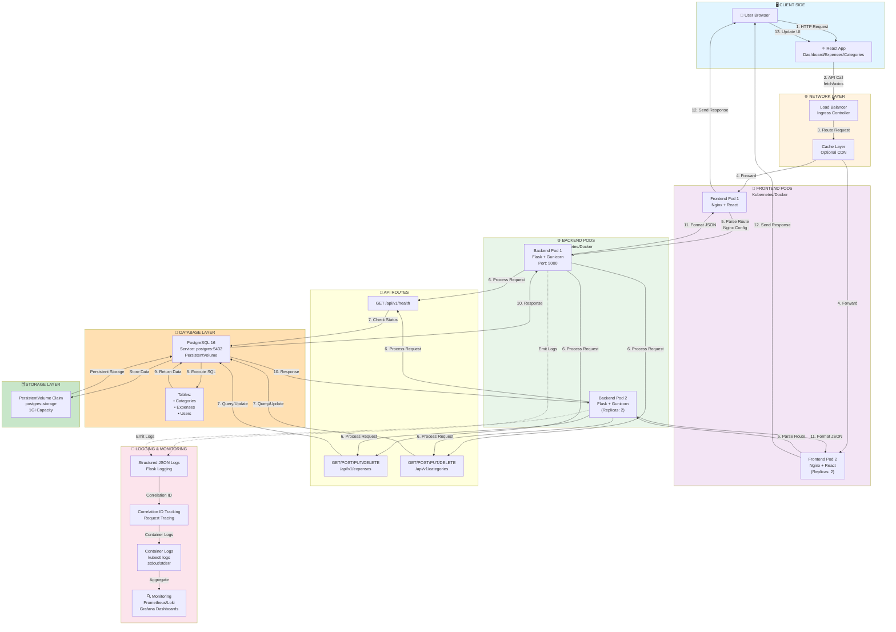
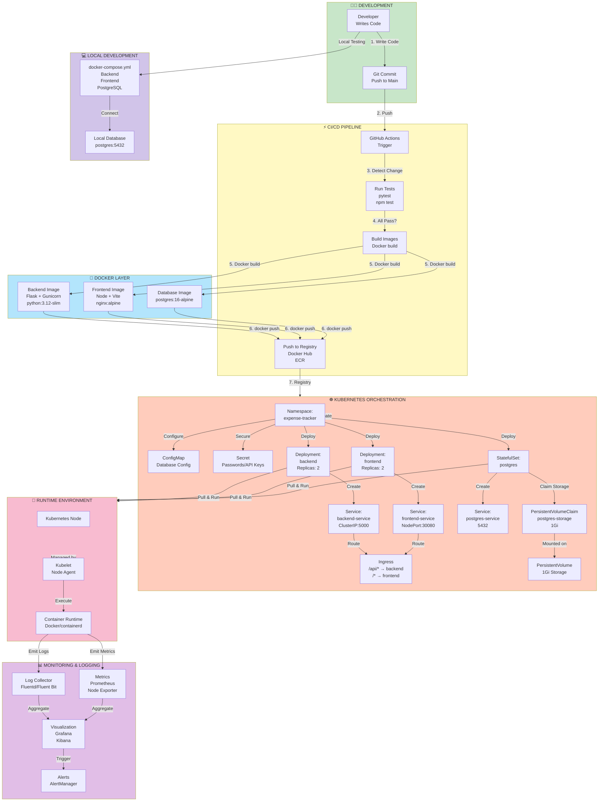

# Expense Tracker: Request Flow & DevOps Architecture

## 📊 Complete Request Flow Chart



---

## 🔄 DevOps Infrastructure Workflow



---

## 📋 Request Lifecycle Details

### 1️⃣ **User Initiates Request**
```
Browser → API Call (fetch/axios)
GET /api/v1/expenses
Headers: {Authorization, Content-Type, Correlation-ID}
```

### 2️⃣ **Frontend Pod Processing**
```
Nginx → 
  Route Analysis (/api/* → backend-service)
  → Pass to Backend Service
```

### 3️⃣ **Load Balancing & Routing**
```
Kubernetes Service (backend-service) →
  Load Balance between Pod 1 & Pod 2 →
  Route to available Backend Pod
```

### 4️⃣ **Backend Processing**
```
Flask Application:
  1. Receive HTTP Request
  2. Extract Correlation ID (Logging)
  3. Route to appropriate handler
  4. Validate inputs
  5. Query Database
```

### 5️⃣ **Database Operation**
```
Query Plan:
  1. Parse SQL Query
  2. Check Cache
  3. Fetch from Disk (PersistentVolume)
  4. Return Result Set
  5. Close Connection
```

### 6️⃣ **Response Generation**
```
Backend:
  1. Process Data
  2. Serialize to JSON
  3. Add Correlation ID to headers
  4. Send HTTP Response
  5. Emit Structured Log
```

### 7️⃣ **Frontend Rendering**
```
React:
  1. Receive Response
  2. Parse JSON
  3. Update State
  4. Re-render Components
  5. Display to User
```

### 8️⃣ **Logging & Monitoring**
```
All Layers:
  1. Flask Logger → JSON Format → stdout
  2. Correlation ID tracking across request
  3. Container Logs collected by Kubernetes
  4. Fluentd aggregates logs
  5. Kibana/Grafana visualizes
  6. Alerts trigger on anomalies
```

---

## 🏗️ Docker & Kubernetes Integration

### **Local Development (docker-compose)**
```yaml
Frontend Service   → Docker Network → Backend Service
Backend Service    → Docker Network → PostgreSQL
All on: 127.0.0.1 (Single Machine)
```

### **Production (Kubernetes)**
```yaml
Frontend Pod 1  ─┐
                ├─→ Ingress → Internet
Frontend Pod 2  ─┘
                
Backend Pod 1   ─┐
                ├─→ Service (ClusterIP) → Internal Network
Backend Pod 2   ─┘
                
PostgreSQL Pod  → PersistentVolume → Disk Storage
```

---

## 🔐 Security & Best Practices Flow

```
User Request
    ↓
HTTPS/TLS Layer (Ingress)
    ↓
Authentication (Bearer Token)
    ↓
Authorization (Role-based)
    ↓
Input Validation
    ↓
Rate Limiting
    ↓
Process Request
    ↓
Database Query (Parameterized)
    ↓
Response + Security Headers
    ↓
User Browser (CORS Validated)
```

---

## 📊 Key Infrastructure Files

| File | Purpose |
|------|---------|
| `docker-compose.yml` | Local development orchestration |
| `backend/Dockerfile` | Backend container image |
| `frontend/Dockerfile` | Frontend container image |
| `kubernetes/namespace.yaml` | Kubernetes namespace isolation |
| `kubernetes/backend-deployment.yaml` | Backend pod replicas |
| `kubernetes/frontend-deployment.yaml` | Frontend pod replicas |
| `kubernetes/postgres-storage.yaml` | Persistent data storage |
| `kubernetes/ingress.yaml` | External traffic routing |
| `kubernetes/services.yaml` | Internal service discovery |
| `kubernetes/secret.yaml` | Sensitive credentials |
| `kubernetes/configmap.yaml` | Configuration data |

---

## 🚀 Scaling & High Availability

```
Production Setup:
├── Kubernetes Cluster (3 Nodes)
├── Frontend Pods: 2-5 replicas
├── Backend Pods: 2-5 replicas (HPA)
├── PostgreSQL: 1 primary + N replicas
├── Load Balancer: Distributes traffic
├── Auto-scaling: CPU/Memory based
└── Health Checks: Liveness & Readiness probes
```

This architecture ensures:
- ✅ High Availability (Pod replicas)
- ✅ Load Distribution (Service LoadBalancing)
- ✅ Data Persistence (PersistentVolumes)
- ✅ Self-healing (Kubernetes restarts failed pods)
- ✅ Easy Scaling (Horizontal Pod Autoscaler)
- ✅ Structured Logging (Correlation across services)
- ✅ Security (Network policies, secrets management)
